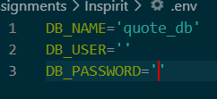

# Inspirit-Group-Project-2

## Description 

After creating an account, you can seek inspiration by reading quotes from a variety of speakers. If any of those quotes resonates with you, you can save those to your portfolio for later viewing.

## Installation

Running this application locally requires node.js and MySQL Server. Clone this repository by opening a terminal in the folder which will hold it and enter "git clone https://github.com/BrendanShelton/Inspirit.git". Install dependencies by opening the main folder of this application containing "server.js" in a terminal and enter "npm install". Create a .env file and add your MySQL username and password and the name of the database, as shown below in the second screenshot. To create the database, open the "db" folder in a terminal and enter "mysql -u (your MySQL username) -p" to open a MySQL shell and then enter "source schema.sql". Seed the database by entering "npm run seed" in the terminal opened in the main folder.

## Deployed App Link

https://powerful-fortress-16397.herokuapp.com/

## Usage

Enter "npm start" in the terminal and go to http://localhost:3001/ in an internet browser. A user can create an account, read through quotes, and save/unsave those quotes to their portfolio.

## Credits

This project was created by Hunter Shutteworth, Brendan Shelton, Matthew Swineford, and Brayden Burleigh. Bootstrap and Bulma were utilized for some of the CSS as well.

## Future Development Plans

We plan to add a larger database of quotes, perhaps by pulling in an already existing API, as well as include images/paintings/pictures. In the user's portfolio, they may be able to add their own quote to the database as well as save more than one quote for their later viewing. In addition, users will be able to comment on the quotes that they saved. And for responsiveness, better quality sizing when the screen size is smaller.

## License

MIT
